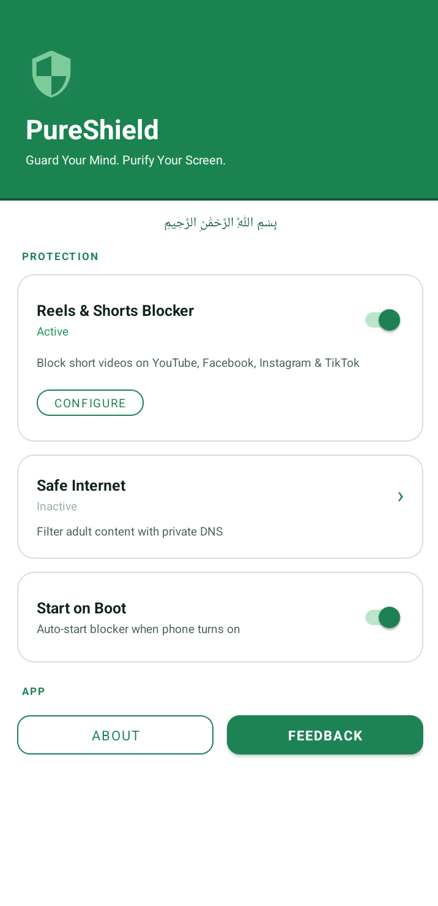
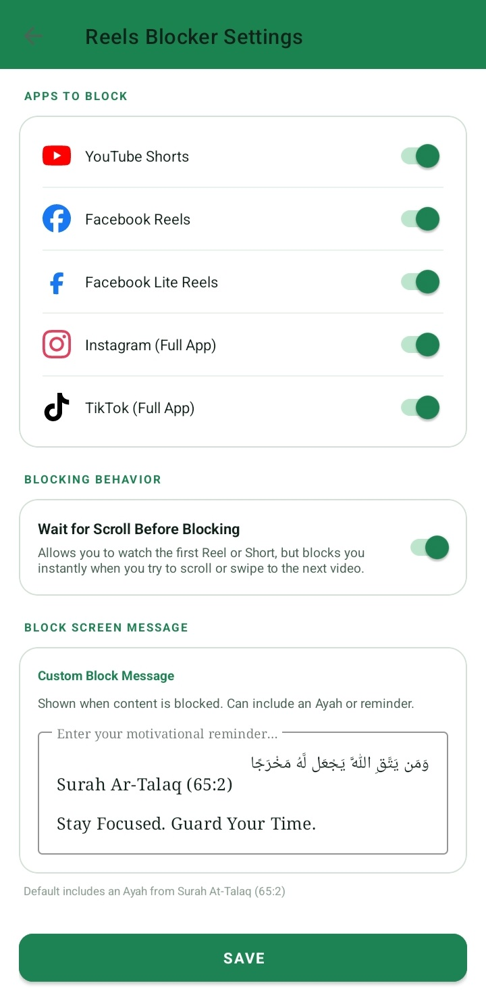
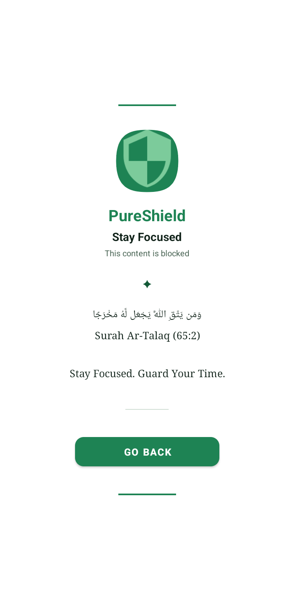

  <h1>🛡️ PureShield</h1>
  
<b>Stay Focused. Guard Your Time</b>

  
<i>بِسْمِ اللَّهِ الرَّحْمَٰنِ الرَّحِيمِ</i>

  

    
    
    
    
  

  
A lightweight, privacy-respecting Android Application focused on digital wellbeing: blocking short-form content (Reels/Shorts) and filtering harmful web content, all without collecting any data

---

## 📌 Table of Contents

- [Features](#-features)
- [Screenshots](#-screenshots)
- [Contributing](#-contributing)
- [License](#-license)

---

## ✨ Features

- **Reels & Shorts Blocker**: Accurately detects and blocks addictive short-form video UI without breaking the core functionality of the apps. Supported platforms:
  - YouTube Shorts
  - Facebook Reels & FB Lite Reels
  - Instagram
  - TikTok
- **Flexible Blocking Behavior**: Choose how strict blocking should be:
  - **Block Instantly**: Exit as soon as Reels/Shorts is detected.
  - **Block on Scroll**: Allows the first video, then blocks when you swipe to the next one.
- **Safe Internet (Private DNS)**: Easily apply community-trusted DNS filters to block adult material network-wide. Defaults include:
  - CleanBrowsing (Family/Adult filters)
  - Cloudflare Family
- **Start on Boot**: Automatically and silently initiates protection when your phone turns on.
- **Customizable Reminder Messages**: Personalize the block screen with custom text, Ayahs, or reminders to stay grounded.

## 📸 Screenshots

| Home | Customize Settings | Active Overlay |
| :---: | :---: | :---: |
|  |  |  |

## 🤝 Contributing

Contributions are highly welcome! Whether it's finding bugs, adding support for new social media apps, improving the UI, or translating the application, your help is appreciated.

## 📄 License

This project is licensed under <a href="https://www.gnu.org/licenses/gpl-3.0.en.html">GPL-3.0</a>.

Anyone may use, share, and modify this code under the terms of the GNU GPL v3.
